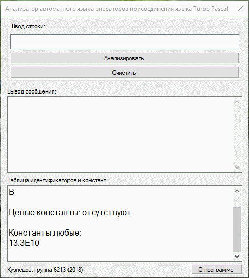

# Теория автоматов и формальных языков (2018)

## Скриншот

## Задание
Написать программу синтаксического анализа автоматного языка операторов присоединения языка Turbo Pascal, имеющего вид:

0) WITH <переменная> DO <оператор присваивания>;

1) <переменная> ::= <идентификатор>[,<идентификатор>]|<идентификатор>.<идентификатор>

2) <оператор присваивания> ::= <левая часть> := <правая часть> 

3) <левая часть> ::= <идентификатор>[{ [<идентификатор>] [<целая константа>] }]

4) <правая часть> :: = <оператор>[<операция><оператор>] 

5) <оператор> :: = <идентификатор>[{ [<идентификатор>] [<целая константа>] }] | <константа любая>

6) <операция> :: = { + - / * div mod}

* <идентификатор> — идентификатор языка Turbo Pascal, начинается с буквы или знака подчеркивания, включает буквы, цифры, не допускает пробелы и специальные символы, ввести ограничение на длину(не более 8 символов) и не может быть зарезервированным словом(WITH, DO, div, mod)

* <константа целая> — целое число в диапазоне от -32768 до +32767

* <константа любая> — целое число, число с фиксированной точкой, число с плавающей точкой
           
## Семантика:
Построить таблицу идентификаторов и констант. Учесть перечисленные выше ограничения на идентификаторы и константы.
Сообщать об ошибках при анализе цепочек языка, указывая курсором место ошибки и её содержание.

## Примеры правильных цепочек: 
* WITH A DO B := 13.3E - 10; 
* WITH A, B DO C := ‘текст’; 
* WITH A.D DO L := 18.1 + D; 
* WITH A.D, C.M DO _A_N [-3] := 3E + 2 - _D1 [ I ];
